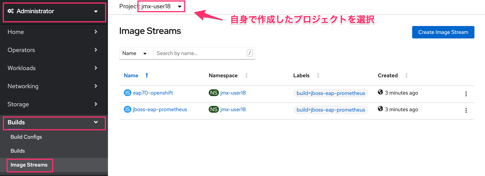
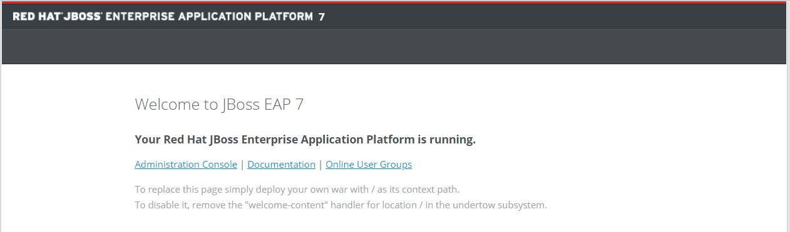
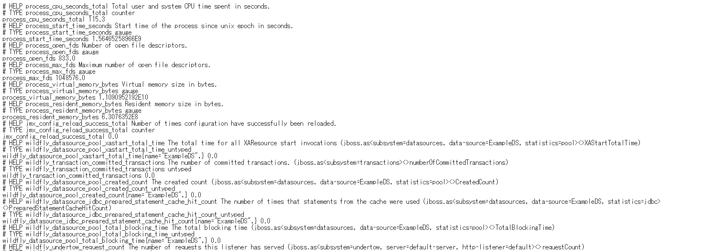

# 1. Prometheus JMX Exporterの展開  

## 1-1. 諸注意

### 1-1-1. JMX Exporterについて

* JMX Exporter は2通りの動作を提供する  
Java Agent (推奨): Java Agent 用 JAR ファイルからメトリクスを収集   
HTTP server: リモートの JMX ターゲットからメトリクスを取得し、HTTP サーバで公開する  
* Java Agent 用 JARファイルの配置方法は次の2通り  
Docker Build Strategy: Dockerfile にビルド済み JAR ファイルを取得し配置する  
S2I: pom.xml に Dependency をセットし、S2I 実行時に Maven でビルドする  

### 1-1-2. 事前準備
- 踏み台サーバー(Bastion Server)へのアクセス情報
- OpenShift4クラスターへのアクセス情報

>自身でハンズオンを実施される場合は，事前に以下を準備ください。
> - OpenShift4クラスター環境
> - ocコマンドのセットアップ
> - 利用ユーザーへのcluster-adminの権限付与

## 1-2. アプリケーション展開

### 1-2-1. OpenShift4へのログイン  
1. 踏み台サーバー(Bastion Server)にSSHでログインします。
    ```
    $ ssh -i <Private_Key> <Bastion_User_ID>@<Bastion_Server_IP>
  
    y
    ```

    >**※注意: ワークショップ参加者の方は，必ず自身に割当てられた <Bastion_User_ID>，<Bastion_Servier_IP>，<Private_Key> を使用してください。**  
    >
    >
    >例) 「踏み台サーバー(Bastion Server)」のSSHログイン情報
    > - `<Bastion_User_ID>`: **user18**
    > - `<Bastion_Server_IP>`: **1.2.3.4**
    > - `<Private_Key>`: **bs-key.pem**
    >
    >実行例) 
    >```
    >$ ssh -i bs-key.pem user18@1.2.3.4
    >```

1. OpenShift4クラスターにocコマンドでログインします。

    OpenShift APIのドメインをもとに，コマンドからOpenShiftにログインを行います。  
    ここではノードを確認することで，接続の可否を確認します。  

    ```
    $ oc login <OpenShift_API>

    Username: "<User_ID>" を入力
    Password: "<User_PW>" を入力
    ```

    >**※注意: ワークショップ参加者の方は，必ず自身に割当てられた <OpenShift_API>，<User_ID>，<User_PW> を使用してください。**  
    >
    >
    >例) 「OpenShift_API」へのログイン情報
    > - `<OpenShift_API>`: **https://api.group9.capsmalt.org:6443**
    > - `<User_ID>`: **user18**
    > - `<User_PW>`: **ocppass**
    >
    >実行例) 
    >```
    >$ oc login https://api.group9.capsmalt.org:6443  
    >Username: user18
    >Password: ocppass
    >```
    >
    > 上記は，Group番号が **"9"** ，User番号が **"18"** の方のログイン例です。    

    次に，OpenShift4クラスターを構成するノードを確認します。  
       
    ```
    $ oc get node  
    
    NAME                                              STATUS   ROLES    AGE   VERSION
    ip-10-0-128-108.ap-northeast-1.compute.internal   Ready    master   15h   v1.13.4+509f0153f
    ip-10-0-141-52.ap-northeast-1.compute.internal    Ready    worker   15h   v1.13.4+509f0153f
    ip-10-0-151-196.ap-northeast-1.compute.internal   Ready    worker   15h   v1.13.4+509f0153f
    ip-10-0-159-143.ap-northeast-1.compute.internal   Ready    master   15h   v1.13.4+509f0153f
    ip-10-0-162-88.ap-northeast-1.compute.internal    Ready    master   15h   v1.13.4+509f0153f
    ip-10-0-175-15.ap-northeast-1.compute.internal    Ready    worker   15h   v1.13.4+509f0153f
    ```
    
    >上記のように，複数台のMasterとWorkerノードで構成されており，STATUSが Readyであることを確認します。
    >なお，ハンズオン環境においては，ノード台数が異なる場合があります。

### 1-2-2. アプリケーションビルド  
1. 監視対象アプリケーション用の「jmx-<User_ID>」という名前のプロジェクトを作ります。

    ```
    $ oc new-project jmx-<User_ID>
    $ oc project
    Using project "jmx-<User_ID>" on server "https://<OpenShift API>".
    ```

    >**※注意: ワークショップ参加者の方は，必ず自身に割当てられた <User_ID> を使用してください。**  
    >
    >
    >実行例)
    >
    >```
    >$ oc new-project jmx-user18 
    >$ oc get project | grep jmx-user18
    >
    >jmx-user18        Active
    >```
    >
    >上記のように，自身の `User_ID`を使用したプロジェクト名が出力されることを確認します。  
    >(例では `jmx-user18`)


1. アプリケーションをリポジトリからCloneして，「jboss-eap-prometheus」イメージをビルドします。

    ```
    $ git clone https://github.com/openlab-red/jboss-eap-prometheus
    $ cd ./jboss-eap-prometheus/
    $ oc new-build . -n jmx-<User_ID>
    --> Found Docker image b72b49b (18 months old) from registry.access.redhat.com for "registry.access.redhat.com/jboss-eap-7/eap70-openshift:latest"
    …
    --> Success
    ```

1. ビルドの状況をocコマンドと、OpenShift4コンソールからも確認します。

    ```
    $ oc logs -f bc/jboss-eap-prometheus
    …
    Writing manifest to image destination
    Storing signatures
    Push successful
    ※イメージがPushされると動的にログから開放されるので待つ。
    (もし「Errorとなってしまった場合は」、[Ctl] + [C]で出て再度やり直す)

    $ oc get build -n jmx-<User_ID>    
    NAME                     TYPE     FROM          STATUS     STARTED          DURATION
    jboss-eap-prometheus-1   Docker   Git@23160b8   Complete   38 minutes ago   1m28s    
    
    $ oc get imagestream -n jmx-<User_ID>
    NAME                   IMAGE REPOSITORY                                                                   TAGS     UPDATED
    eap70-openshift        image-registry.openshift-image-registry.svc:5000/jmx-<User_ID>/eap70-openshift        latest   37 minutes ago
    jboss-eap-prometheus   image-registry.openshift-image-registry.svc:5000/jmx-<User_ID>/jboss-eap-prometheus   latest   36 minutes ago
    ```

    OpenShift4コンソールにログインして，[Builds]>[Image Streams]から，ビルドしたイメージがImageStreamに登録されていることも確認しましょう。

    

### 1-2-3. アプリケーションデプロイ  

1. アプリケーションの展開

    ここでは，登録した「jboss-eap-prometheus」を利用して，アプリケーションを展開します。  
    展開の際には，Java Agent用JARファイルやJMX Exporter設定ファイルのパスを環境変数(jmx-prometheus.jar=9404)で指定しておきましょう。

    ```
    $ export JBOSS_HOME=/opt/eap
    $ oc new-app -i jboss-eap-prometheus:latest \
      -n jmx-<User_ID> \
      --name=jboss-eap-prometheus \
      -e PREPEND_JAVA_OPTS="-javaagent:${JBOSS_HOME}/prometheus/jmx-prometheus.jar=9404:${JBOSS_HOME}/prometheus/config.yaml"

    上記を `\` で改行しながら1コマンドとして実行します。
    
    --> Found image 55806df (About a minute old) in image stream "jmx-<User_ID>/jboss-eap-prometheus" under tag "latest" for "jboss-eap-prometheus:latest"
    …
    --> Success
        Application is not exposed. You can expose services to the outside world by executing one or more of the commands below:
         'oc expose svc/jboss-eap-prometheus'
        Run 'oc status' to view your app.
    ```

1. 展開したアプリケーションの確認

    この時点で「jboss-eap-prometheus-1」がRunning状態になれば，デプロイ成功です。  
    JMX Exporter はデフォルトで9404ポートを公開します。

```
$ oc get svc/jboss-eap-prometheus -n jmx-<User_ID>
NAME                   TYPE        CLUSTER-IP       EXTERNAL-IP   PORT(S)                               AGE
jboss-eap-prometheus   ClusterIP   172.30.159.173   <none>        8080/TCP,8443/TCP,8778/TCP,9404/TCP   30s

$ oc get dc/jboss-eap-prometheus -n jmx-<User_ID>
NAME                   REVISION   DESIRED   CURRENT   TRIGGERED BY
jboss-eap-prometheus   1          1         1         config,image(jboss-eap-prometheus:latest)

$ oc get pod -n jmx-<User_ID>
NAME                           READY   STATUS      RESTARTS   AGE
jboss-eap-prometheus-1-2z9zs   1/1     Running     0          4m50s
jboss-eap-prometheus-1-deploy  0/1     Completed   0          4m59s
jboss-eap-prometheus-1-build   0/1     Completed   0          9m19s
```

「jboss-eap-prometheus-1-2z9zs」(2z9zsはデプロイしたときにランダムに生成される)がRunning状態になるまで待ちましょう。

### 1-2-4. アプリケーションのアノテーション設定

JMX ExporterのServiceに対して、アノテーションをつけておく。   

```
$ oc annotate svc jboss-eap-prometheus prometheus.io/scrape='true' -n jmx-<User_ID>
service/jboss-eap-prometheus annotated

$ oc annotate svc jboss-eap-prometheus prometheus.io/port='9404' -n jmx-<User_ID>
service/jboss-eap-prometheus annotated
```

### 1-2-5. アプリケーションのルータ設定 

「jboss-eap-prometheus」のアプリケーション(tcp-8080)ポートを、ルータに接続。

```
$ oc expose svc/jboss-eap-prometheus --name=tcp-8080 --port=8080 -n jmx-<User_ID>
route.route.openshift.io/tcp-8080 exposed

$ oc get route tcp-8080 -n jmx-<User_ID>
NAME       HOST/PORT                                PATH   SERVICES               PORT   TERMINATION   WILDCARD
tcp-8080   tcp-8080-jmx.XXX.openshiftworkshop.com          jboss-eap-prometheus   8080                 None
```

Host/Port (http://tcp-8080-jmx.XXXX.openshiftworkshop.com) をブラウザ上からアクセスすると、アプリケーションコンテンツが確認できる。   
    


次に「jboss-eap-prometheus」のPromtheus Exporter(tcp-9404)ポートを、ルータに接続。

```
$ oc expose svc/jboss-eap-prometheus --name=tcp-9404 --port=9404 -n jmx-<User_ID>
route.route.openshift.io/tcp-9404 exposed

$ oc get route tcp-9404 -n jmx-<User_ID>
NAME       HOST/PORT                                PATH   SERVICES               PORT   TERMINATION   WILDCARD
tcp-9404   tcp-9404-jmx.XXX.openshiftworkshop.com          jboss-eap-prometheus   9404                 None
```

Host/Port (tcp-9404-jmx.XXXX.openshiftworkshop.com) をブラウザ上からアクセスすると、JMX Exporterから取得したPromSQLのクエリが確認できる。   
    


これで、JMX Exporterの設定は完了。次に[Prometheus Operator](2_PrometheusOperator.md)の作業に進む   

