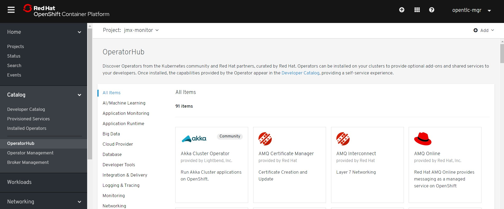
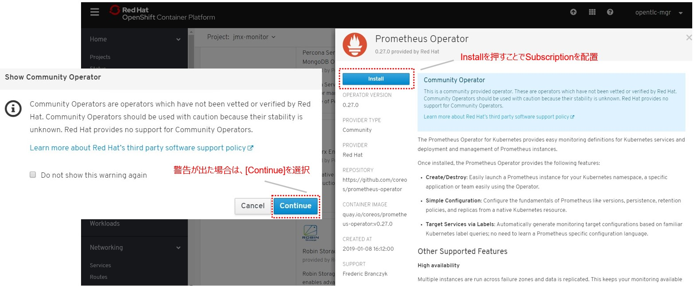
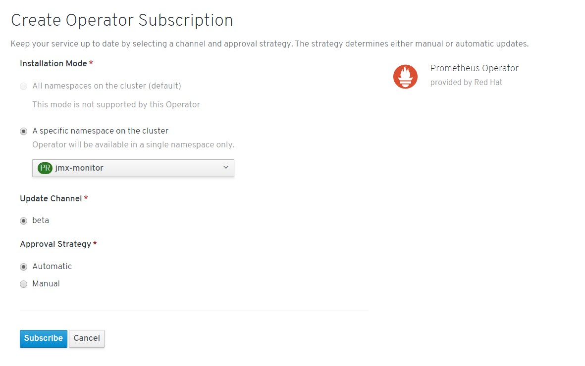
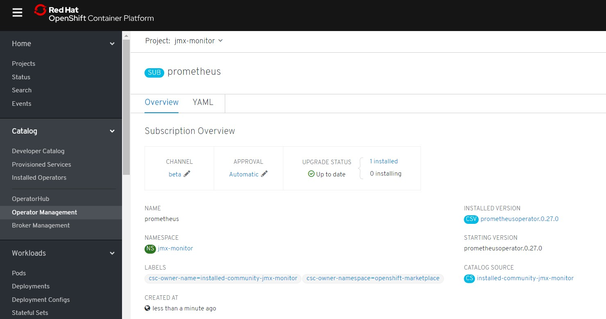
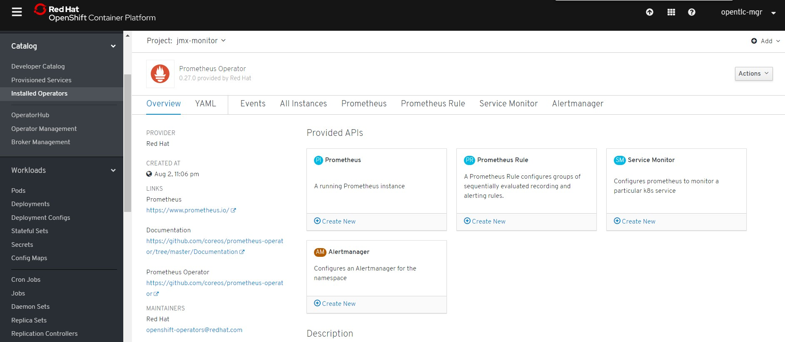

# 2. Prometheus Operatorの展開 

## 2-1. 諸注意

### 2-1-1. Prometheus Operatorについて

PrometheusOperatorは、Kubernetesサービスの簡単な監視定義、およびPrometheusインスタンスの展開と管理を提供します。    
Prometheus Operatorは次の機能を提供します。    

* 容易なPrometheusの作成/破棄：Kubernetes名前空間、特定のアプリケーション、またはチーム用のPrometheusインスタンスをOperatorを使って簡単に起動できます。
* シンプルな設定：CRDを通してPrometheusのバージョン、永続性、保存ポリシー、レプリカなどの基本設定ができます。
* ラベルを介したターゲット：Kubernetesラベルクエリに基づいて、監視ターゲット構成を自動的に生成します。そのため、Prometheus固有の言語を学ぶ必要がありません。

### 2-1-2. 事前準備

* 事前にJMX Exporterを用意しておく。
* 「OpenShift Portal」のアドレス  
例: http://console.openshiftworkshop.com  
* 「Openshift API」のアドレス <OpenShift API>  
例: https://api.cluster.openshiftworkshop.com:6443  
* OpenShiftの(system:admin)ログイン情報

## 2-2. Prometheus Operatorの展開
### 2-2-1. プロジェクト作成  
Prometheus Operator用のプロジェクトを作成する。

```
$ oc new-project jmx-monitor-<User_ID>
$ oc project
Using project "jmx-monitor-<User_ID>" on server "https://<OpenShift API>".
```

### 2-2-2. Subscriptionを作成  
ブラウザからOpenShift Portalにログインし、[Catalog]>[Operator Hub]からPrometheusを検索する。   
この際、プロジェクトが「jmx-monitor-<User_ID>」であることを確認しておく。   
          


OperatorHubの中から、Prometheus Operator(Community)を選択して、[Install]を行う。        
※コミュニティ版を利用すると、警告が表示されるので、一旦[Continue]で続ける。(OCP 4.1現在)    
     


Subscriptionは、以下の設定で作成する。  
* Installation Mode  
A specific namespace on the cluster: [PR] jmx-monitor-<User_ID>  
* Update Channel  
beta  
* Approval Strategy  
Automatic   
  
|InstallMode|Action|
|:--|:--|
|OwnNamespace|Operatorは、独自のnamespace を選択するOperatorGroupのメンバーにできます。|
|SingleNamespace|Operatorは1つのnamespace を選択するOperatorGroupのメンバーにできます。|
|MultiNamespace|Operatorは複数の namespace を選択するOperatorGroupのメンバーにできます。|
|AllNamespaces|Operatorはすべての namespace を選択するOperatorGroupのメンバーできます (ターゲット namespace 設定は空の文字列 "" です)。|

実際にGUI上では以下のように設定します。
   


正しくSubscriptionが設定されると、[UPGRADE STATUS]がInstalledになりOperatorが展開されます。また、以下のように[Catalog]>[Operator Management]から、Subscriptionの概要が確認できます。



これで、Prometheus OperatorのSubscriptionが作成されました。なおこの時点では、CRDの登録やPrometheus Operatorの配置が行われるだけで、Prometheusのプロセス自体は構築されません。

### 2-2-3. CRD/Operatorの確認    

Prometheus OperatorのSubscriptionを作成すると、CRD(Custom Resource Definition)が作成される。

```
$ oc get crd -n jmx-monitor-<User_ID> |grep monitoring.coreos.com
alertmanagers.monitoring.coreos.com                         2019-08-01T05:51:14Z
prometheuses.monitoring.coreos.com                          2019-08-01T05:51:14Z
prometheusrules.monitoring.coreos.com                       2019-08-01T05:51:14Z
servicemonitors.monitoring.coreos.com                       2019-08-01T05:51:14Z
```

Promethus Operatorは、標準で４つのCRDを保持している。  
GUIからは[Catalog]>[Installed Operators]>[Prometheus Operator] を確認。オペレーターカタログとして、デプロイされたPromethus OperatorのCRDが確認できる。



また、Prometheus OperatorがOLMによって配置される。

```
$ oc get po -n jmx-monitor-<User_ID>
NAME                                   READY   STATUS    RESTARTS   AGE
prometheus-operator-7cf7d5f74b-r4qmd   1/1     Running   0          16m
```

以上で、Promethus Operatorの準備が整いました。次の[CustomResourceの設定](3_CustomResource.md)作業に進む   
