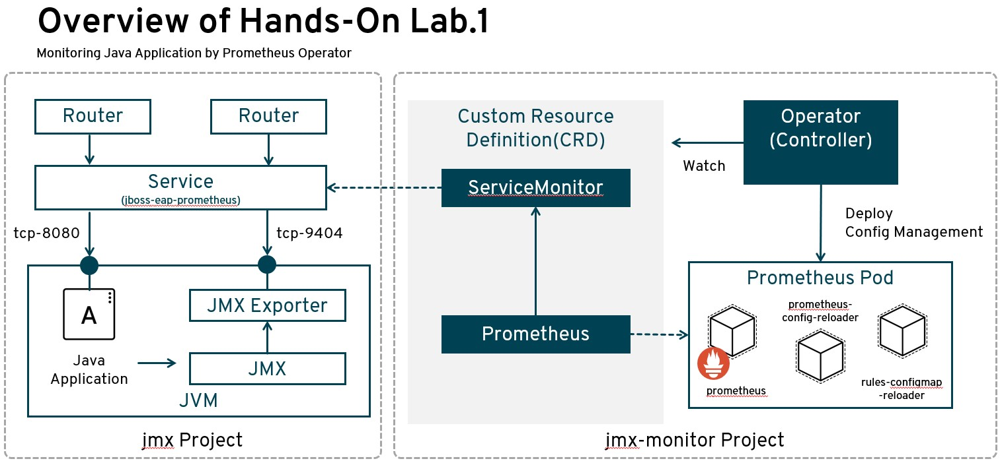

# OpenShift Ops Lab3
　OpenShiftクラスターに付随しているOperatorHubから、Prometheusを活用して、アプリケーションの監視の基礎を学ぶ。

## 概要
　
JBoss EAPのアプリケーションを立ち上げ、Prometheus JMX ExporterからJMXメトリクスを収集する。   
また、OperatorHubに登録されているPrometheus Operatorを活用して、JMXメトリクスの情報を可視化する。

## 前提条件
- OpenShift Container Platform 4.Xのデプロイメント
- ocコマンドのセットアップ  
- sysytem:adminの権限利用

## ラボ構成

### 実装手順
作業は以下の手順どおりに進める。

1. [Prometheus JMX Exporterの展開](1_jmx-exporter.md)  
2. [Prometheus Operatorの展開](2_PrometheusOperator.md)  
3. [CustomResourceの設定](3_CustomResource.md)  

## References

* JMX Exporter for Prometheus  
https://github.com/prometheus/jmx_exporter  
* JBoss EAP - JMX Exporter Prometheus Metrics  
https://github.com/openlab-red/jboss-eapprometheus  
* Include JMX exporter for Prometheus in JBoss EAP  
https://issues.jboss.org/browse/PRODMGT-1855  
* jboss.container.prometheus.api   
https://github.com/jboss-openshift/cct_module/blob/master/jboss/container/prometheus/api/README.adoc  
* JBoss EAP 6.4 Container Image (1.9-19) Dockerfile   
https://access.redhat.com/containers/?tab=docker-file#/registry.access.redhat.com/jboss-eap-6/eap64-openshift/images/1.9-191  

