# 1. PostgreSQL Operatorのインストール  

## 1-1. 諸注意

### 1-1-1. PostgreSQL Operatorについて
Crunchy Data PostgreSQL Operator(以降，Postgres Operator)は，Kubernetes上におけるPostgreSQLの運用を担うOperatorです。また，専用のCLI(pgo)も用意されており，Custom Resourceの展開や制御を簡単に行うことができます。pgoの利用は[Lab2-2のハンズオン](2_usage-pgo.md)で実施します。

Postgres Operatorを展開することで，以下の機能をK8sクラスターに拡張できます。(抜粋)  
* PostgreSQLクラスター構築/削除
* Posgresインスタンスのスケールアウト/スケールイン
* Posgresインスタンスバックアップ/リストア

### 1-1-2. 事前準備
- 踏み台サーバー(Bastion Server)へのアクセス情報
- OpenShift4クラスターへのアクセス情報

>自身でハンズオンを実施される場合は，事前に以下を準備ください。
> - OpenShift4クラスター環境
> - ocコマンドのセットアップ
> - 利用ユーザーへのcluster-adminの権限付与

## 1-2. Postgres Operatorプロジェクトの取得
### 1-2-1. ocコマンドによるログイン(oc login)
1. 踏み台サーバー(Bastion Server)にSSHでログインします。
    ```
    $ ssh -i <Private_Key> <Bastion_User_ID>@<Bastion_Server_IP>
  
    y
    ```

    >**※注意: ワークショップ参加者の方は，必ず自身に割当てられた <Bastion_User_ID>，<Bastion_Servier_IP>，<Private_Key> を使用してください。**  
    >
    >
    >例) 「踏み台サーバー(Bastion Server)」のSSHログイン情報
    > - `<Bastion_User_ID>`: **user18**
    > - `<Bastion_Server_IP>`: **1.2.3.4**
    > - `<Private_Key>`: **bs-key.pem**
    >
    >実行例) 
    >```
    >$ ssh -i bs-key.pem user18@1.2.3.4
    >```

1. OpenShift4クラスターにocコマンドでログインします。

    ```
    $ oc login <OpenShift_API>

    Username: "<User_ID>" を入力
    Password: "<User_PW>" を入力
    ```

    >**※注意: ワークショップ参加者の方は，必ず自身に割当てられた <OpenShift_API>，<User_ID>，<User_PW> を使用してください。**  
    >
    >
    >例) 「OpenShift_API」へのログイン情報
    > - `<OpenShift_API>`: **https://api.group9.capsmalt.org:6443**
    > - `<User_ID>`: **user18**
    > - `<User_PW>`: **ocppass**
    >
    >実行例) 
    >```
    >$ oc login https://api.group9.capsmalt.org:6443  
    >Username: user18
    >Password: ocppass
    >```
    >
    > 上記は，Group番号が **"9"** ，User番号が **"18"** の方のログイン例です。    

### 1-2-2. GitHubからプロジェクトをクローン
GitHubから Postgres-Operatorプロジェクトをクローンします。  

```
$ git clone https://github.com/capsmalt/postgres-operator.git
$ cd postgres-operator
$ ls

Gopkg.lock         PULL_REQUEST_TEMPLATE.md  apiservermsgs  controller        operator              redhat   util
Gopkg.toml         README.md                 bin            crunchy_logo.png  pgo                   rhel7    vendor
ISSUE_TEMPLATE.md  ansible                   btn.png        deploy            pgo-backrest          sshutil
LICENSE.md         apis                      centos7        examples          pgo-scheduler         testing
Makefile           apiserver                 conf           hugo              postgres-operator.go  tlsutil
Makefile.buildah   apiserver.go              config         kubeapi           pv                    ubi7
```

正しいプロジェクトをクローンできていると上記のように出力されます。


### 1-2-3. ルートディレクトリのパスを設定 (export $PGOROOT)
この後何度も使用するため，Postgres-Operatorディレクトリのパスを登録しておきます。

```
$ export PGOROOT=$HOME/postgres-operator
$ cd $PGOROOT
$ pwd

/home/<User_ID>/postgres-operator
```

上記のように出力されていればOKです。

.bashrcに "PGOROOT" を追記しておきましょう。  

```
cat <<EOF >> $HOME/.bashrc
export PGOROOT=$HOME/postgres-operator
EOF
source $HOME/.bashrc
```

>Tips:  
>
>`.bashrc` に，`PGOROOT` を登録するのは，ターミナルを閉じた場合などに再度exportする必要が無くなるようにするためです。

### 1-3. Postgres Operatorのインストール準備
### 1-3-1. プロジェクト(Namespace)の作成
Postgres Operatorを動作させるプロジェクトを作成します。

```
$ oc new-project pgo-<User_ID> 
$ oc get project | grep pgo-<User_ID>
```

>**※注意: ワークショップ参加者の方は，必ず自身に割当てられた <User_ID> を使用してください。**  
>
>
>実行例)
>
>```
>$ oc new-project pgo-user18 
>$ oc get project | grep pgo-user18
>
>pgo-user18        Active
>```
>
>上記のように，自身の `User_ID`を使用したプロジェクト名が出力されることを確認します。  
>(例では `pgo-user18`)


### 1-3-2. Secretを作成します。
Postgresクラスターのバックアップ作成に必要なSecret (`pgo-backrest-repo-config`)を作成します。  

```
$ oc create secret generic -n pgo-<User_ID> pgo-backrest-repo-config \
  --from-file=config=$PGOROOT/conf/pgo-backrest-repo/config \
  --from-file=sshd_config=$PGOROOT/conf/pgo-backrest-repo/sshd_config \
  --from-file=aws-s3-credentials.yaml=$PGOROOT/conf/pgo-backrest-repo/aws-s3-credentials.yaml \
  --from-file=aws-s3-ca.crt=$PGOROOT/conf/pgo-backrest-repo/aws-s3-ca.crt
  
上記のようにバックスラッシュ (**"\"**) を入れることで改行し，多数のオプションを付与してコマンド実行しています。
```

>**※注意: ワークショップ参加者の方は，必ず自身に割当てられた <User_ID> を使用して，Namespaceオプションで `-n pgo-user18` のように指定してください。**  
>
>
>実行例)
>
>```
>$ oc create secret generic -n pgo-user18 pgo-backrest-repo-config \
>  --from-file=config=$PGOROOT/conf/pgo-backrest-repo/config \
>  --from-file=sshd_config=$PGOROOT/conf/pgo-backrest-repo/sshd_config \
>  --from-file=aws-s3-credentials.yaml=$PGOROOT/conf/pgo-backrest-repo/aws-s3-credentials.yaml \
>  --from-file=aws-s3-ca.crt=$PGOROOT/conf/pgo-backrest-repo/aws-s3-ca.crt
>
>secret/pgo-backrest-repo-config created
>```
>
>実行イメージ図)
>
>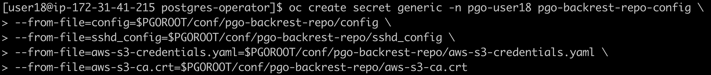
>
>作成したSecret (`pgo-backrest-repo-config`) が存在するか確認してみましょう。
>
>```
>$ oc get secret -n pgo-user18
>
>NAME                       TYPE                                  DATA   AGE
>builder-dockercfg-zslcx    kubernetes.io/dockercfg               1      54s
>builder-token-5c84k        kubernetes.io/service-account-token   4      54s
>builder-token-fdrjm        kubernetes.io/service-account-token   4      54s
>default-dockercfg-7csct    kubernetes.io/dockercfg               1      54s
>default-token-hwf5d        kubernetes.io/service-account-token   4      54s
>default-token-zpx46        kubernetes.io/service-account-token   4      54s
>deployer-dockercfg-spqcl   kubernetes.io/dockercfg               1      54s
>deployer-token-mhpbl       kubernetes.io/service-account-token   4      54s
>deployer-token-xlvq8       kubernetes.io/service-account-token   4      54s
>pgo-backrest-repo-config   Opaque                                4      50s
>```
>

## 1-4. Operatorをインストール
### 1-4-1. ブラウザからOpenShift4コンソールにログイン
OpenShift4コンソールにログインします。

ブラウザ(Chrome or Firefox)からOpenShift4のコンソールにログインします。

>**注意: ワークショップ参加者の方は，必ず自身に割当てられた <OpenShift_Console>，<User_ID>，<User_PW> を使用してください。**  
>
>例) 「OpenShift4コンソール」のログイン情報
> - `<OpenShift_Console>`: **https://console-openshift-console.apps.group9.capsmalt.org**
> - capsmalt's group を選択
> - `<User_ID>`: **user18**
> - `<User_PW>`: **ocppass**

Privacy Errorが出た場合は，[Advanced] > [Proceed to oauth-openshift.apps.group9.capsmalt.org (unsafe)] のように選択して進めてください。

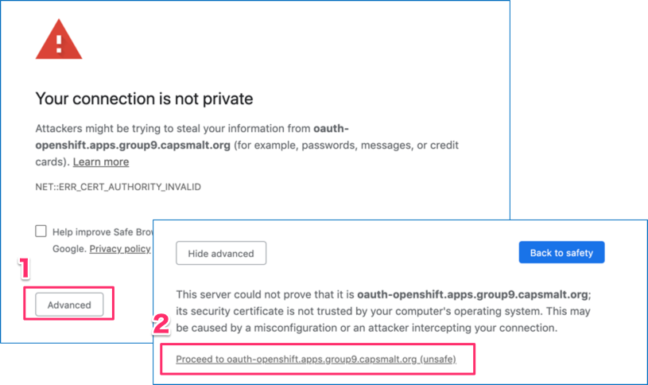

[capsmalt's group] を選択し，ログイン情報を入力してコンソールにログインします。

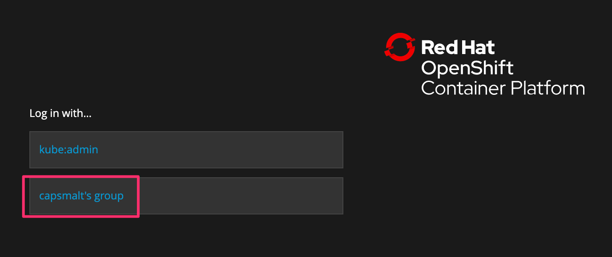

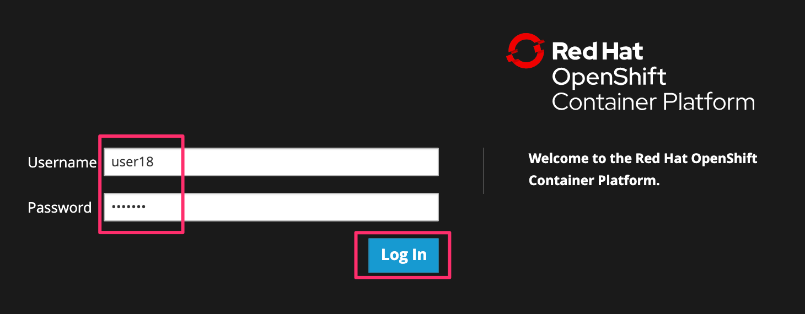

### 1-4-2. OperatorHubからPostgres Operatorをインストール
OperatorHubから，Postgres Operator ("Crunchy PostgresSQL Enterprise")をインストールします。  

[Catalog]>[OperatorHub]から，[Crunchy PostgreSQL Enterprise (Community)]を開きます。

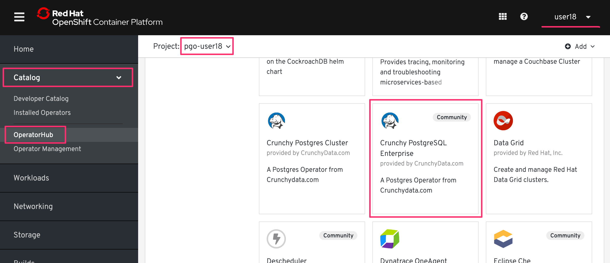

>**注意: 必ず自身のプロジェクト(`pgo-<User_ID>`)が選択されていることを確認してください。**

[Continue]を選択します。

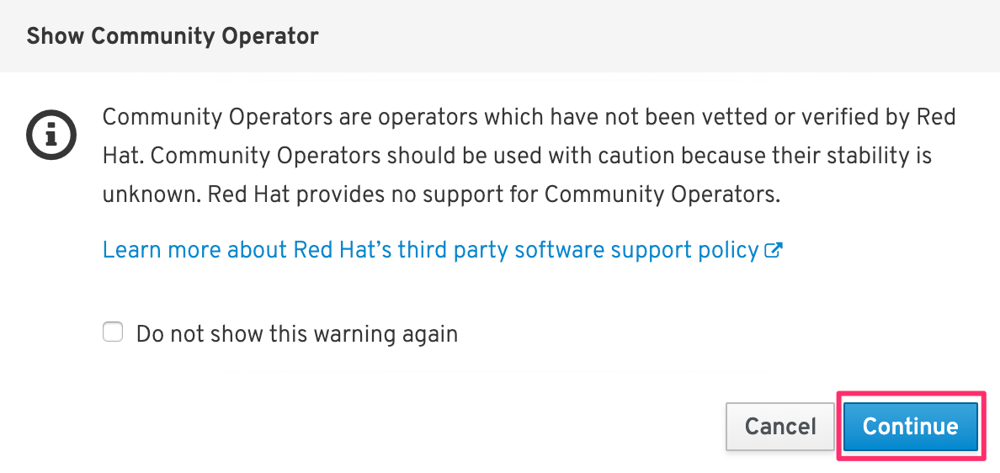

[Install]とを選択します。

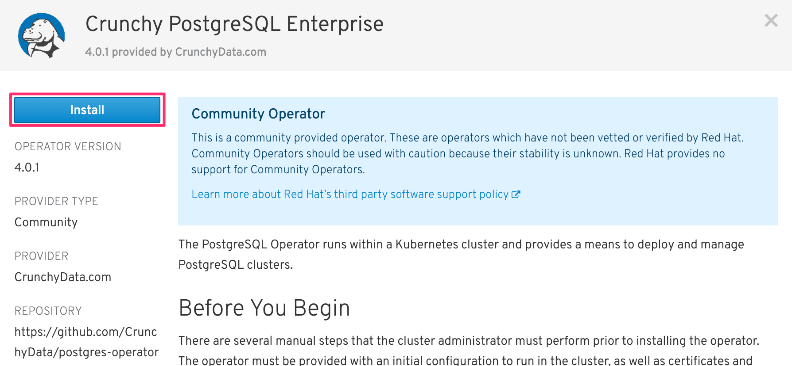

Operator Subscriptionを作成します。  

- Installation Mode: `A specific namespace on cluster` (デフォルト)
- Namespace: `pgo-<User_ID>` (自身のプロジェクト名を選択)
- Update Channel: `alpha` (デフォルト)
- Approval Strategy: `Manual` 

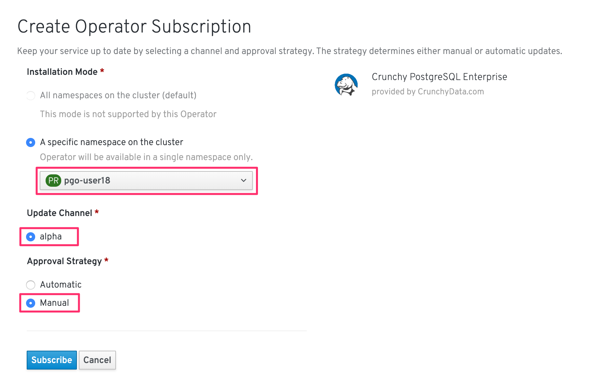

以下図に遷移したら，少し待ちます。 

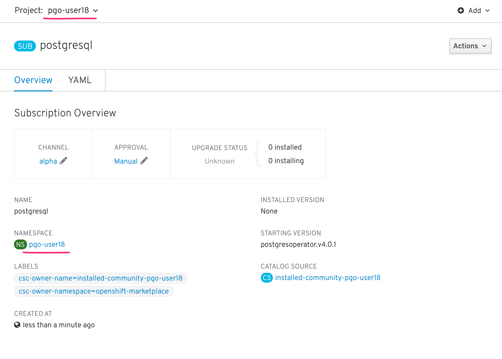

"1 requres approval" の表記を確認したら選択します。

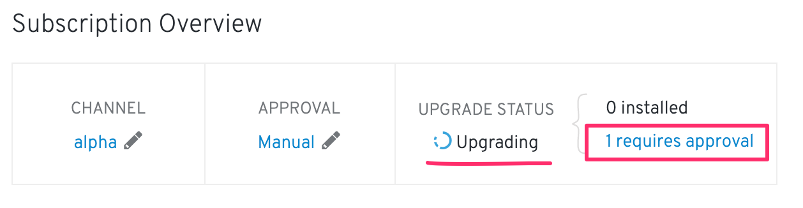

"Preview Install Plan" を選択します。

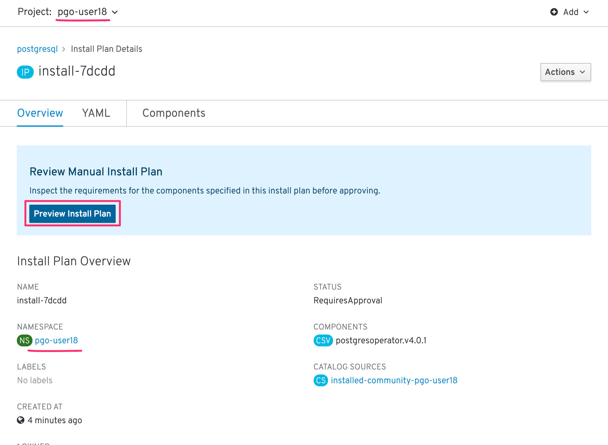

"Approve" を選択します。

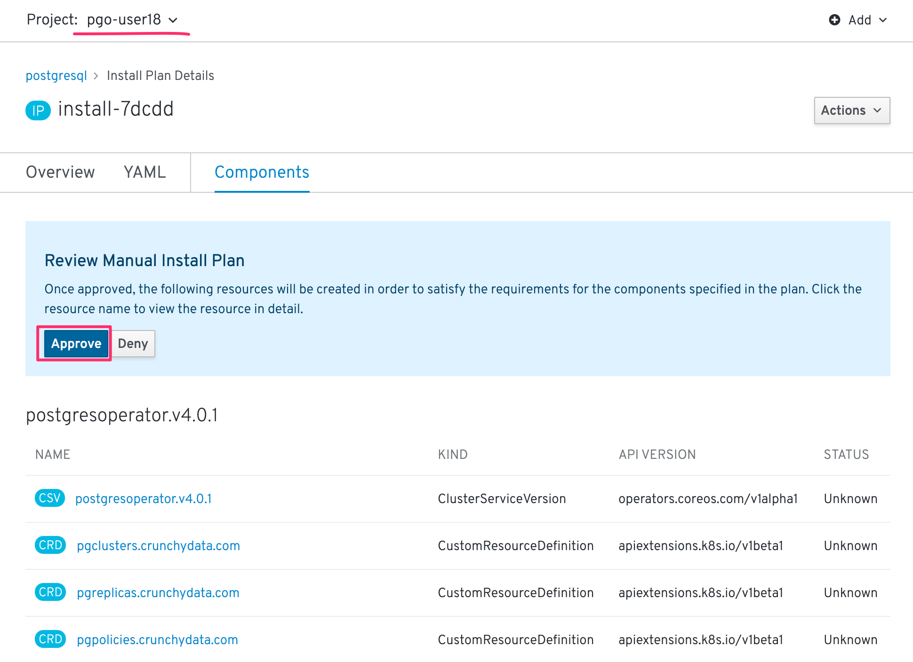

以下のような画面に遷移します。  

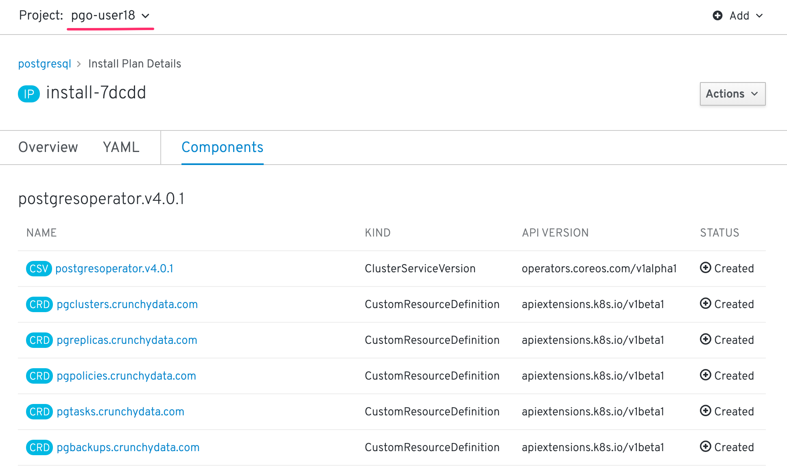

[Catalog]>[Installed Operators]を開き，[Crunchy PostgreSQL Enterprise]の "STATUS" 欄が "InstallSucceeded" になるのを確認します。

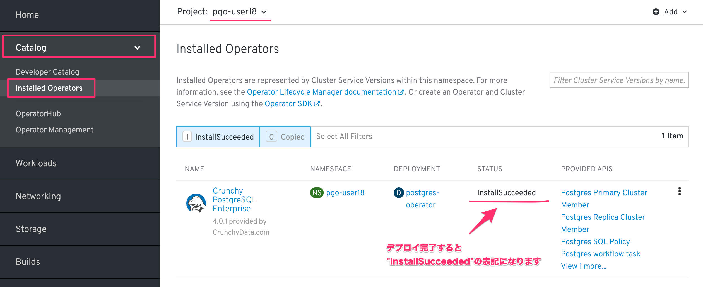

>Tips:  
>
>Operatorのデプロイまで少し時間がかかりますので，少し待ちましょう。  
>その間に，OpenShift4コンソールや`oc`コマンドで各リソースの作成状況を確認してみると良いでしょう。  
>
> OpenShift4コンソールで確認  
> - [Workloads]>[Deployments]
> - [Workloads]>[Pods]
> - [Workloads]>[Secrets]
>
> `oc`コマンドで確認
> ```
> $ oc get deployment -n pgo-<User_ID>
> $ oc get pod -n pgo-<User_ID>
> $ oc get secret -n pgo-<User_ID>

## 1-5. Postgres Operatorのインストール確認
### 1-5-1. Postgres CRDを確認
踏み台サーバー(Bastion Server)から `oc` コマンドを使ってPostgres CRDを確認します。

```
$ oc get crd | grep pg

pgbackups.crunchydata.com                                   2019-09-02T10:59:34Z
pgclusters.crunchydata.com                                  2019-09-02T10:59:34Z
pgpolicies.crunchydata.com                                  2019-09-02T10:59:34Z
pgreplicas.crunchydata.com                                  2019-09-02T10:59:34Z
pgtasks.crunchydata.com                                     2019-09-02T10:59:34Z
```

OpenShift4コンソールからも確認してみます。  
[Administration]>[Custom Resource Definitions]を開き，検索バーで `pg` と入力します。


上図のように，5つのPostgresを制御するCRDが確認できます。

### 1-5-2. Operator Podを確認
Postgres OperatorのDeploymentは1つのPodを管理しています。Podには3つのコンテナが含まれます。

* operator
* scheduler
* apiserver

ocコマンドで確認します。

```
$ oc get deploy -n pgo-<User_ID>
$ oc describe deploy postgres-operator -n pgo-<User_ID>
```

>実行例)
>
>```
>$ oc get deploy -n pgo-user18
>
>NAME                READY   UP-TO-DATE   AVAILABLE   AGE
>postgres-operator   1/1     1            1           25m
>
>
>$ oc describe deploy postgres-operator -n pgo-user18
>(出力結果は表示していません)
>```

```
$ oc get po -n pgo-<User_ID>
```

>実行例)
>
>```
>$ oc get po -n pgo-user18
>
>NAME                                 READY   STATUS    RESTARTS   AGE
>postgres-operator-74c4fbf46c-r7llt   3/3     Running   0          33m


OpenShift4コンソールからもPodやコンテナを確認してみましょう。

[Workloads]>[Pods]>[postgres-operator-xxxx-xxx]を開くと，Podに3つのコンテナが含まれる様子や，YAML定義，リソース利用状況などが確認できます。

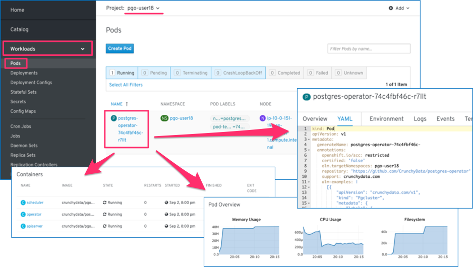  


>Tips:
>
>OpenShift4コンソール上のターミナルを使用して，Podに含まれるコンテナ内を確認できます。  
>すぐにコンテナアクセスができるため，デバッグなどで役立つ場合があります。  
>
>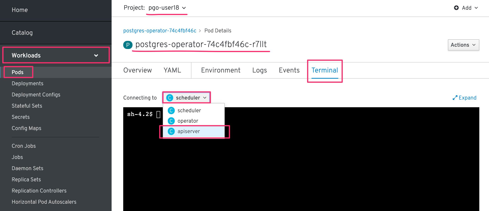

## 1-6. Operator Podの公開
Operator PodをService(type:LoadBanancer)を使用して公開します。

今回は `oc expose` コマンドを使用します。

```
$ oc expose deployment -n pgo-<User_ID> postgres-operator --type=LoadBalancer
$ oc get svc -n pgo-<User_ID>

NAME                             TYPE           CLUSTER-IP       EXTERNAL-IP                                                                    PORT(S)                                         AGE
postgres-operator                LoadBalancer   172.30.114.68    a6615bd17b98011e992ee0e4cddef59e-1242048699.ap-northeast-1.elb.amazonaws.com   8443:32455/TCP                                  130m
```

>Tips:  
>
>"EXTERNAL-IP" の項目が "pending" になっている場合は，AWS上のELBの準備に時間がかかっているためです。  
>実績値としては，30ユーザーほどで同時に実施した場合，5-10秒待つとIPアドレスが反映されました。

---
これで，Crunchy PostgreSQL Operatorの展開は完了です。  
次に [pgoの構成とPostgreSQLリソース制御](2_usage-pgo.md) のハンズオンに進みます。
