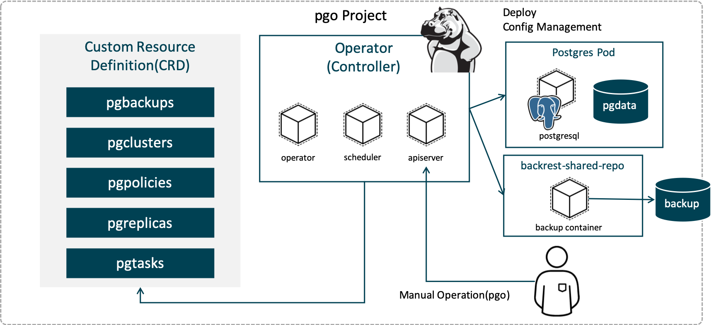

# OpenShift4 Ops Lab4
OpenShift4に付随するOperatorHub上のCommunity版のPostgreSQL Operatorを活用して，Operatorのインストール手順や付属CLIの利用方法を学びます。

## 概要
　
GitHubで公開されているOSSの [CrunchyData/postgres-operator](https://github.com/CrunchyData/postgres-operator) を使用して，Kubernetesのディストリビューションの一つであるOpenShift(OCP)上にOperatorをインストールする手順を学びます。さらにOCP上に展開したPostgres OperatorのPodに対して，クライアント環境からpgo(Postgres Operatorを制御するCLI)を使って接続し，制御を行います。専用CLI(pgo)でのCustom Resource(Postgresクラスターやレプリカ，タスクなど)の制御を体験します。

### 実施手順
作業は以下の手順どおりに進めます。

1. [Crunchy PostgreSQL Operatorのインストール](1_installtion-postgres-operator-pgo.md)  
2. [pgoの構成とPostgreSQLリソース制御](2_usage-pgo.md)  

## References

* [GitHub] - CrunchyData/postgres-operator  
https://github.com/CrunchyData/postgres-operator
* [Docs] - Crunchy Data PostgreSQL Operator
https://access.crunchydata.com/documentation/postgres-operator/4.0.1/
* [Operator Hub] - Crunchy PostgreSQL Enterprise  
https://operatorhub.io/operator/postgresql
